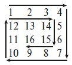

## CH_Bonus5: Spiral Traversal
Write generic method spiral_traversal(values2dim) that traverses a two-dimensional
rectangular array (or a nested list) in the form of a spiral and prepares it as a list. The start
is in the upper left corner. First the outer layer is traversed and then the next inner layer.

Example

For the following two arrays, the number or letter sequences listed below should be
the results of a spiral traversal:

numbers = [[1, 2, 3, 4],

[12, 13, 14, 5],

[11, 16, 15, 6],

[10, 9, 8, 7]]

letterPairs = [["AB", "BC", "CD", "DE"],

["JK", "KL", "LM", "EF"],

["IJ", "HI", "GH", "FG"]]

=>

[1, 2, 3, 4, 5, 6, 7, 8, 9, 10, 11, 12, 13, 14, 15, 16]

[AB, BC, CD, DE, EF, FG, GH, HI, IJ, JK, KL, LM]