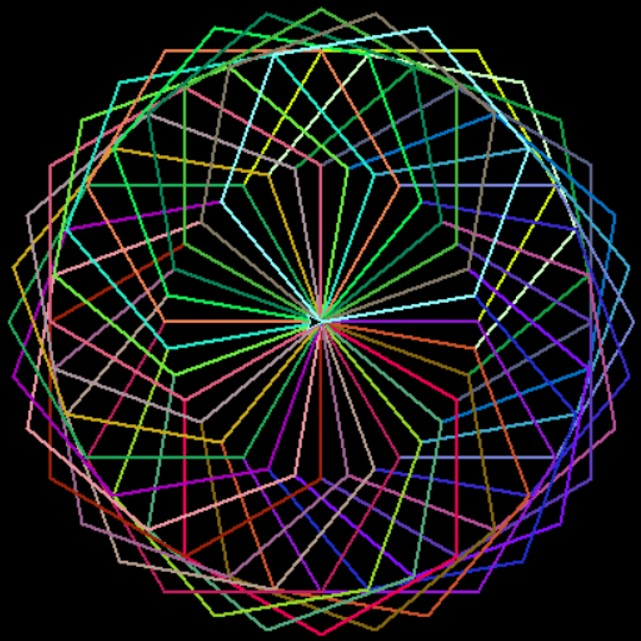

#Generative Art
in this projects you see example of simple generative arts

to read more about generative take a look at the following links:
[]()

##how to run the projects
### requirements
before run the project you should install PythonTurtle package by running following command in your command-line
```
pip install PythonTurtle
```
### output examples

heart output example


hexagons output example



colorful maze output example

